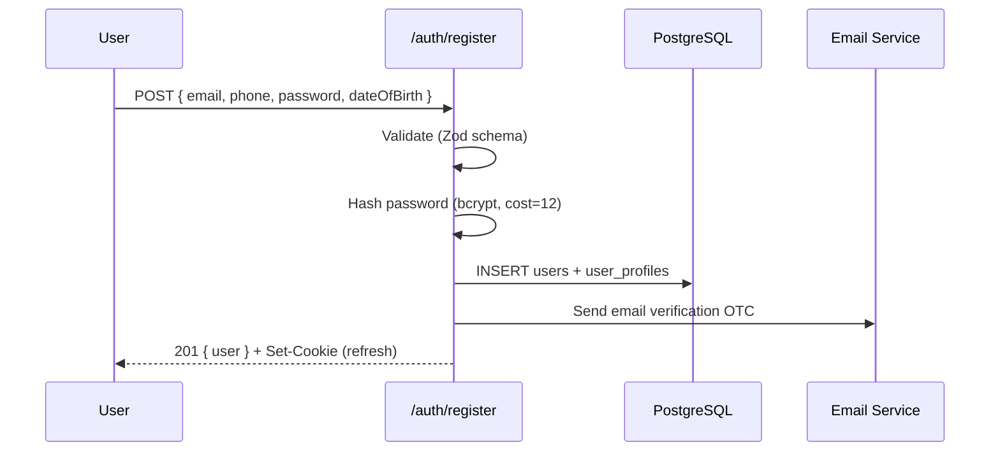
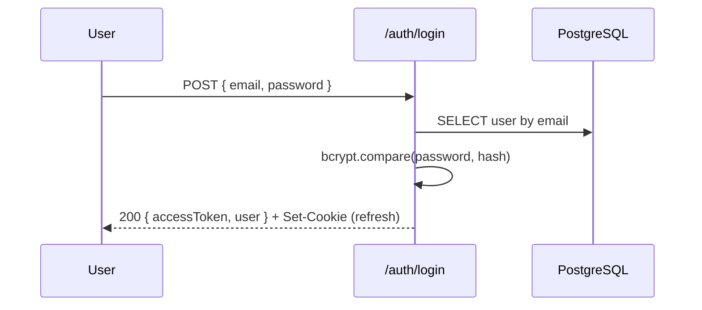
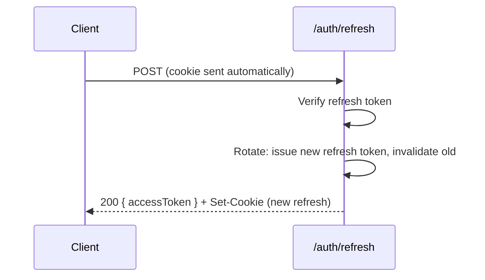

# Architecture: Authentication Flow

> **Status:** Design complete — implementation next.

## Overview

gigs.ge uses a **stateless JWT** pattern with a short-lived access token and a long-lived httpOnly refresh cookie. This is the standard approach for SPAs that need to talk to an API on a different origin without exposing tokens to JavaScript.

## Token Pair

| Token | Where | Lifetime | Purpose |
|-------|-------|----------|---------|
| **Access token** | `Authorization: Bearer <token>` header | 15 minutes | Authenticates API requests |
| **Refresh token** | `httpOnly` cookie (`SameSite=Strict`) | 7 days | Silently renews the access token |

Why 15 minutes? Short enough that a leaked access token has limited blast radius, long enough that users don't see refresh jitter during a typical session.

## Registration



After registration, the user is **authenticated but unverified**. They can view the board (same as a visitor) but cannot post or apply until both email and phone are confirmed.

## Login



## Token Refresh



**Rotation** means every refresh call issues a *new* refresh token. If an attacker replays an old one, the server knows the family was compromised and can revoke all tokens for that user.

## Verification (Email + Phone)

Users must verify **both** channels to reach `verified` status:

| Channel | Method | Endpoint |
|---------|--------|----------|
| Email | 6-digit one-time code (OTC) | `POST /auth/verify/email` |
| Phone | 6-digit OTP via SMS | `POST /auth/verify/phone` |

OTP codes are stored hashed in the `otp_codes` table with:
- Max 5 attempts before expiry
- 10-minute TTL
- 60-second cooldown on resend

> **v1 note:** SMS is stubbed — the OTP is logged to console in development. Real SMS integration comes later.

## Auth Guards

Three Fastify `preHandler` hooks gate access throughout the API:

| Guard | Checks | Used by |
|-------|--------|---------|
| `requireAuth` | Valid access token, user exists, not banned | Any logged-in action |
| `requireVerified` | `requireAuth` + `email_verified` + `phone_verified` | Post gig, apply, contracts |
| `requireAdmin` | `requireAuth` + `role = 'admin'` | All `/admin/*` routes |

These are composable — a route can chain them:

```typescript
app.post('/gigs', {
  preHandler: [requireAuth, requireVerified],
}, createGigHandler);
```

## Rate Limiting

| Scope | Limit | Why |
|-------|-------|-----|
| Auth endpoints (`/auth/*`) | 10 req/min per IP | Brute-force protection |
| OTP resend | 1 req/60s per user | Prevent SMS bombing |
| General API | 100 req/min per user | Fair use |

## Security Decisions

1. **No token in localStorage.** The access token lives in memory (React state / context). On page refresh, the client calls `/auth/refresh` to get a new one.
2. **httpOnly + SameSite=Strict cookie.** The refresh token is invisible to JavaScript and only sent to same-site requests — mitigates XSS and CSRF.
3. **bcrypt cost=12.** Enough to resist brute-force on modern hardware without noticeably slowing login.
4. **Password hash only.** We never store plaintext. The `password_hash` column is the only password artifact.

## Blocked Users

The `users.status` column controls access:

| Status | Can login? | Can act? |
|--------|-----------|----------|
| `active` | Yes | Yes |
| `restricted` | Yes | No posting/applying (unpaid invoices or arbiter faults) |
| `suspended` | No | No |
| `banned` | No | No |

---

**Related:** [Database Design](./database-design.md) · [SYSTEM_DESIGN.md §4](../../SYSTEM_DESIGN.md) · [Getting Started](../guides/getting-started.md)
