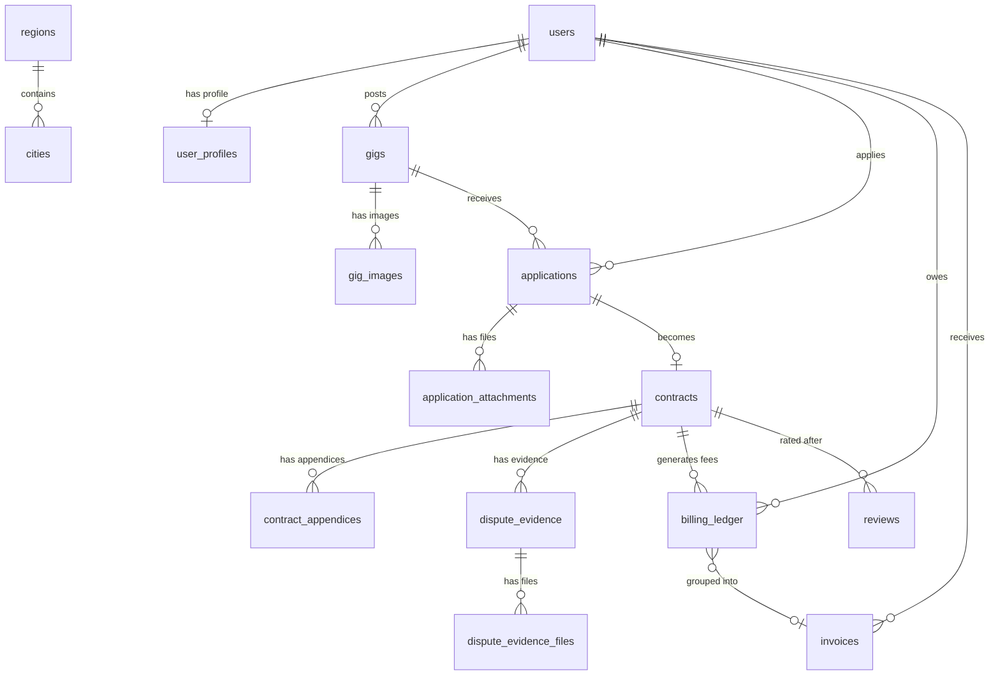

# Architecture: Database Design

> **ORM:** Drizzle · **Engine:** PostgreSQL 16 · **Schema:** `apps/api/src/db/schema/`

## Why Drizzle?

Drizzle ORM gives us type-safe SQL without the magic. Unlike Prisma, it doesn't generate a client — it maps directly to SQL, so what you write is what runs. That matters for a billing system where an unexpected query shape could silently produce wrong fee calculations.

## Schema Organization

Each domain gets its own file. One barrel `index.ts` re-exports everything.

```
apps/api/src/db/schema/
├── users.ts          # Auth credentials, role, status
├── profiles.ts       # PII, visibility toggles, contact info
├── regions.ts        # Georgian geography (მხარე + cities)
├── gigs.ts           # Job listings + images
├── applications.ts   # Worker applications + attachments
├── contracts.ts      # Agreements, appendices, dispute evidence
├── billing.ts        # Ledger entries + invoices
├── reviews.ts        # Post-completion ratings
├── messages.ts       # Notifications + direct messages
├── misc.ts           # OTP codes, info requests, gig flags
└── index.ts          # Barrel export
```

## Table Map

21 tables across 7 domains:

| Domain | Tables | Purpose |
|--------|--------|---------|
| **Identity** | `users`, `user_profiles`, `otp_codes`, `refresh_tokens` | Auth, PII, verification, token families |
| **Geography** | `regions`, `cities` | Georgian მხარე taxonomy (seeded) |
| **Gigs** | `gigs`, `gig_images` | Job listings with per-field visibility |
| **Applications** | `applications`, `application_attachments` | Worker applies for a gig |
| **Contracts** | `contracts`, `contract_appendices`, `dispute_evidence`, `dispute_evidence_files` | Agreement lifecycle + disputes |
| **Billing** | `billing_ledger`, `invoices` | Fee tracking (3%/2%) + monthly invoices |
| **Communication** | `notifications`, `messages`, `info_requests`, `gig_flags`, `reviews` | Messaging, moderation, ratings |

## Conventions

These apply to every table:

| Rule | Implementation |
|------|---------------|
| Primary keys | `UUID` via `gen_random_uuid()` (except `regions`/`cities` which use `SERIAL`) |
| Timestamps | `TIMESTAMPTZ`, stored in UTC, columns named `created_at` / `updated_at` |
| Enums | `TEXT` columns, not Postgres `ENUM` types — avoids painful `ALTER TYPE` migrations |
| Soft status | Status columns (`'active'`, `'draft'`, etc.) instead of soft-delete `deleted_at` flags |
| Uniqueness | Business constraints via `UNIQUE` (e.g., one application per worker per gig) |

## Key Relationships



## Contract Status — The Core State Machine

The `contracts.status` column drives most of the application logic. See [SYSTEM_DESIGN.md §7.5](../../SYSTEM_DESIGN.md) for the full state machine, but here's the summary:

| Status | Meaning | Terminal? |
|--------|---------|-----------|
| `draft` | Created, awaiting signatures | No |
| `in_progress` | Both signed, work underway | No |
| `pending_completion` | One party marked done | No |
| `completed` | Both confirmed (or auto-complete) | Yes |
| `disputed` | Poster marked "Not Done" | No |
| `arbitration` | Submitted to admin | No |
| `auto_resolved` | 7-day dispute timeout, fees for both | Yes |
| `cancelled` | Mutual cancel or arbiter dismissal | Yes |
| `quit` | Worker quit | Yes |

## Seeding

Georgian regions and cities are seeded from `apps/api/src/db/seed.ts`. Run:

```bash
pnpm --filter @gigs/api db:seed
```

This populates 11 regions and ~45 cities. The seed uses `onConflictDoNothing()` so it's safe to run multiple times.

## Migrations

Drizzle Kit generates SQL migrations from schema diffs:

```bash
pnpm --filter @gigs/api db:generate   # Generate migration SQL
pnpm --filter @gigs/api db:migrate    # Apply migrations
pnpm --filter @gigs/api db:push       # Push schema directly (dev only)
pnpm --filter @gigs/api db:studio     # Open Drizzle Studio GUI
```

Config lives at `apps/api/drizzle.config.ts`.

---

**Related:** [Monorepo Structure](./monorepo-structure.md) · [Auth Flow](./auth-flow.md) · [SYSTEM_DESIGN.md](../../SYSTEM_DESIGN.md)
