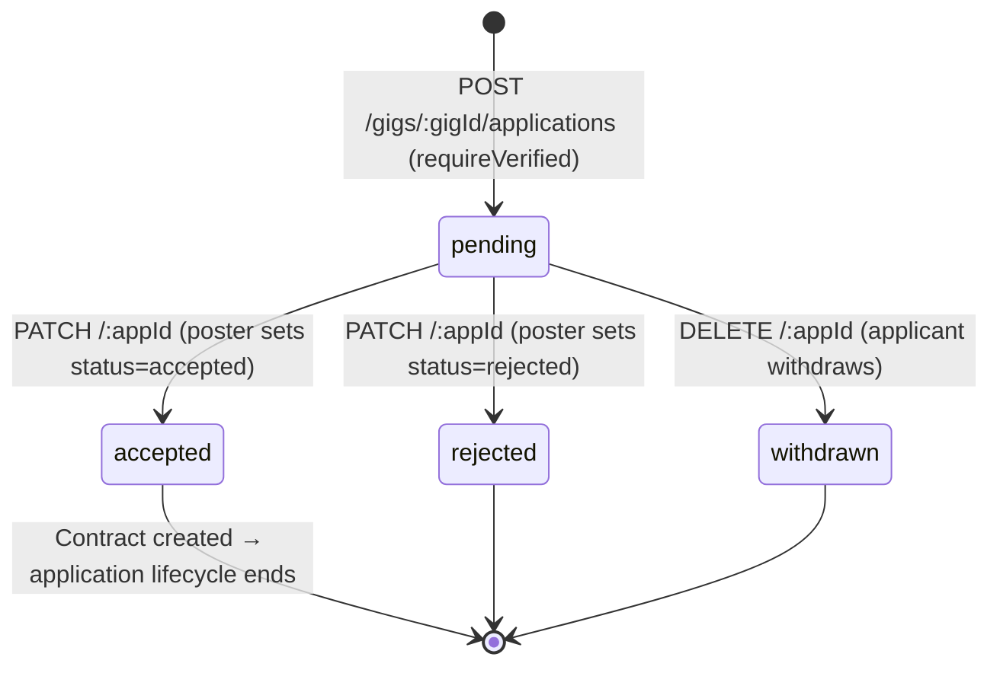
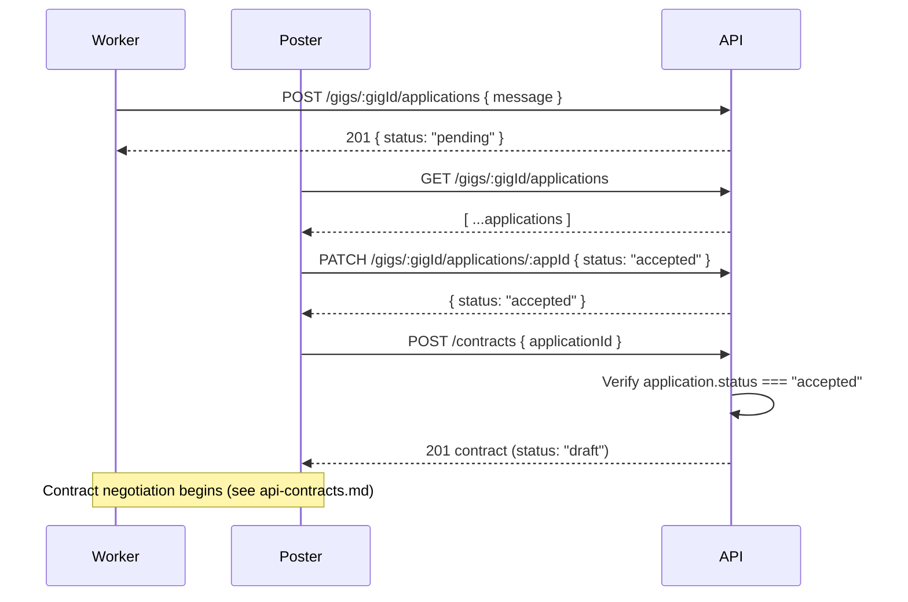

# Guide: Application Flow API

An application is a worker's expression of interest in a gig. It bridges the gap between a public gig listing and a private, negotiated contract.

## Why Applications Exist

A direct "hire me" button that immediately created a contract would be too abrupt. Applications let the poster:

1. Receive multiple candidates and compare them
2. Exchange a message explaining fit or approach
3. Formally accept one (and implicitly reject the others)
4. Then convert the acceptance into a binding contract with agreed terms

This keeps the gig board open and competitive while giving both parties a deliberate on-ramp to contractual commitment.

## Application Status Flow

Once an application is `accepted`, the poster calls `POST /contracts` with the `applicationId` to create the contract. The contract route validates that the application is `accepted` before proceeding, so the link is enforced at the API level.

## Who Can Do What

| Action | Who | Guard |
|--------|-----|-------|
| Submit application | Worker (applicant) | `requireVerified` |
| List applications for a gig | Poster only | `requireAuth` |
| Accept or reject | Poster only | `requireAuth` |
| Withdraw | Applicant only | `requireAuth` |
| Add/remove attachments | Applicant only | `requireAuth` |

Listing applications is restricted to the poster. Applicants cannot see who else applied or the status of other applications — this prevents gaming the system by withdrawing only if a "stronger" applicant appears.

## Attachments

Applicants can upload supporting files (portfolio samples, CVs, etc.) alongside their message via `POST /:appId/attachments`. Maximum **5 attachments** per application (`MAX_APPLICATION_ATTACHMENTS`).

Files are uploaded to Cloudflare R2 separately. This endpoint registers the already-uploaded file URL with the application record. Required fields:

| Field | Type | Notes |
|-------|------|-------|
| `url` | string | R2 public URL |
| `filename` | string | Display name |
| `mimeType` | string | e.g., `application/pdf` |
| `sizeBytes` | number | Used for display, not enforced server-side |

## Applying Rules

- Only `active` gigs accept applications — applying to a `draft`, `shelf`, or `cancelled` gig returns `400`
- Duplicate applications (same user, same gig) return `409` (enforced by DB unique constraint)
- Only `pending` applications can be withdrawn — once accepted or rejected, they are final

## Endpoints Summary

| Method | Path | Auth | Purpose |
|--------|------|------|---------|
| POST | `/gigs/:gigId/applications` | verified | Submit application |
| GET | `/gigs/:gigId/applications` | poster only | List all applications for a gig |
| PATCH | `/gigs/:gigId/applications/:appId` | poster only | Accept or reject |
| DELETE | `/gigs/:gigId/applications/:appId` | applicant only | Withdraw pending application |
| POST | `/gigs/:gigId/applications/:appId/attachments` | applicant only | Attach a file |
| DELETE | `/gigs/:gigId/applications/:appId/attachments/:attId` | applicant only | Remove an attachment |

## Application → Contract Transition

Once the contract is created, the application's own lifecycle is complete — it exists only as a reference record linking the contract back to its origin gig and applicant.

---

**Related:** [API Gigs](./api-gigs.md) · [API Contracts](./api-contracts.md) · [Architecture: Deal Lifecycle](../architecture/deal-lifecycle.md)
