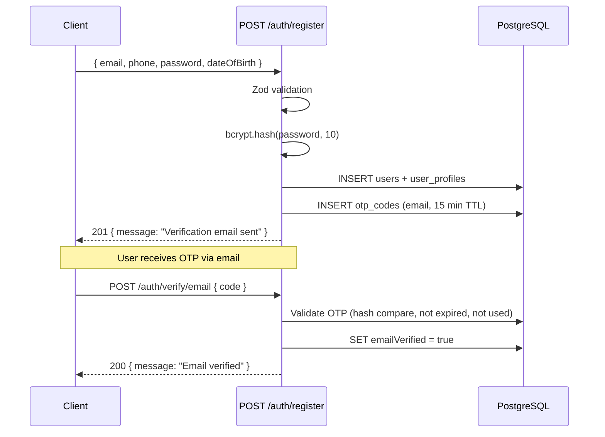
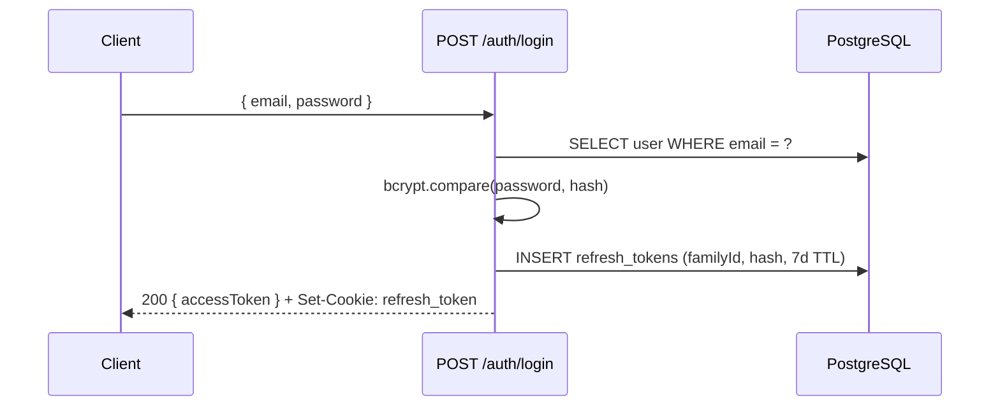
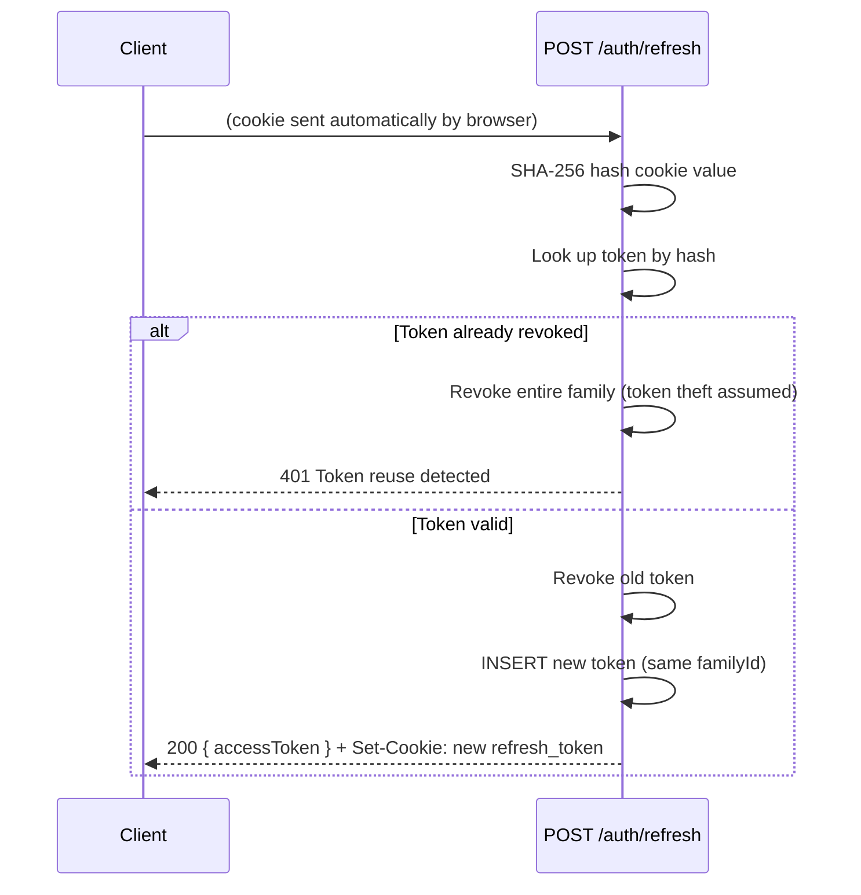

# Guide: Authentication API

The auth system is built around two core ideas: short-lived JWTs for fast request validation and a long-lived httpOnly cookie for silent renewal. Neither token touches `localStorage`, keeping them out of XSS reach.

## Token Pair

| Token | Transport | Lifetime | Purpose |
|-------|-----------|----------|---------|
| **Access token** | `Authorization: Bearer` header | 15 min | Authenticates every API call |
| **Refresh token** | `httpOnly` cookie (`SameSite=Strict`) | 7 days | Silently renews the access token |

Why 15 minutes for the access token? If it leaks (e.g., via a log), the attacker only has a short window. Why httpOnly for the refresh token? JavaScript can't read it, so an XSS exploit can't steal it.

## Register → Verify Flow

After registration the account exists but is **unverified**. `requireVerified` guards block posting gigs and applying until both email and phone are confirmed.

### OTP Details

- Code is a 6-digit integer, stored **hashed** with bcrypt — never plaintext
- TTL: 15 minutes for email/phone OTPs, 60 minutes for password reset tokens
- Resend via `POST /auth/resend-otp` with `{ channel: "email" | "sms" }`

## Login Flow

Banned or suspended accounts get `403` before any token is issued. The `lastAccessedAt` column is updated on every successful login.

## Token Refresh & Rotation

Every call to `POST /auth/refresh` **rotates** the refresh token — the old one is revoked, a brand-new one is set in the cookie. The new token shares the same `familyId` as all its ancestors.

**Why family-based revocation?** If an attacker steals and uses a refresh token, the legitimate user's next refresh will find the token already revoked. The server then revokes the entire lineage, forcing both parties to log in again. This limits the damage window to one refresh cycle.

## Password Reset Flow

1. `POST /auth/forgot-password { email }` — always returns the same message whether or not the email exists (prevents user enumeration)
2. A 64-character reset token is generated, SHA-256 hashed, and stored in `otp_codes` with a 1-hour TTL
3. `POST /auth/reset-password { token, password }` — validates the token hash, updates `passwordHash`, marks the OTP used

## Auth Guards

Three Fastify `preHandler` hooks compose the access tiers:

| Guard | Checks | Used by |
|-------|--------|---------|
| `requireAuth` | Valid JWT, user exists, not banned/suspended | Any authenticated action |
| `requireVerified` | `requireAuth` + `emailVerified` + `phoneVerified` | Post gig, apply, create contract |
| `requireAdmin` | `requireAuth` + `role = 'admin'` | All `/admin/*` routes |

## Endpoints Summary

| Method | Path | Auth | Purpose |
|--------|------|------|---------|
| POST | `/auth/register` | — | Create account |
| POST | `/auth/login` | — | Authenticate, get tokens |
| POST | `/auth/logout` | — | Revoke refresh token |
| POST | `/auth/refresh` | cookie | Rotate refresh token, get new access token |
| POST | `/auth/verify/email` | required | Confirm email OTP |
| POST | `/auth/verify/phone` | required | Confirm phone OTP |
| POST | `/auth/resend-otp` | required | Request a new OTP |
| POST | `/auth/forgot-password` | — | Trigger password reset email |
| POST | `/auth/reset-password` | — | Set new password via reset token |

---

**Related:** [Architecture: Auth Flow](../architecture/auth-flow.md) · [Database Design](../architecture/database-design.md) · [API Contracts](./api-contracts.md)
