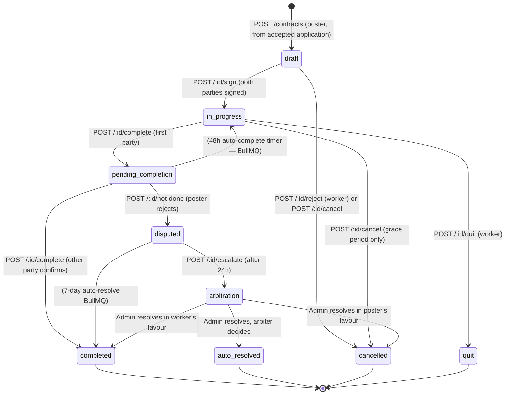
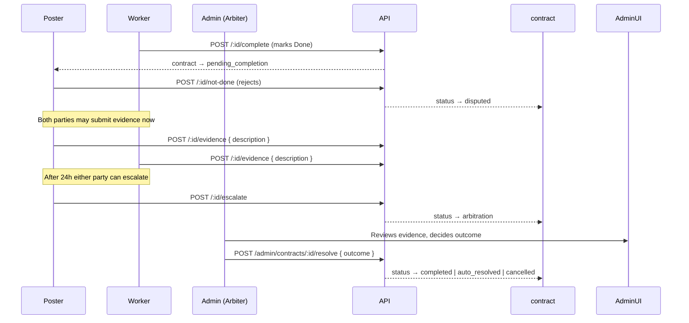

# Guide: Contract Lifecycle API

A contract is created when a poster accepts a worker's application and formalises the engagement. It is the most complex object in the system — it has a multi-step state machine, time-based rules, and fee logic on completion.

## Full State Machine



## Key Business Rules

### 1. Dual Signature Activation

A contract doesn't start until **both parties sign** (`POST /:id/sign`). Either can sign first. Once both `posterSignedAt` and `workerSignedAt` are set, status transitions to `in_progress` automatically within the sign handler.

### 2. Half-Time Rule

Neither party can mark "Complete" until at least **half the contracted duration has elapsed**:

```
halfTime = agreedStartAt + (dueAt - agreedStartAt) / 2
```

This prevents a bad actor from immediately marking a contract complete before any work occurs. If there is no `dueAt`, the check is skipped — it's on the parties to manage open-ended contracts.

### 3. 24-Hour Grace Period

A signed contract can be cancelled within **24 hours** of activation without incurring fees. The grace window starts from the later of the two signatures (the moment the contract genuinely became active).

If cancelled within the grace period, `feeEligible` is set to `false`. If cancelled after, fees would have been incurred on completion — but since the contract is cancelled, they aren't charged. The flag is stored for audit purposes.

### 4. 48-Hour Auto-Complete

Once the first party marks "Complete" (`pending_completion`), the second party has **48 hours to respond**. If they are silent, a BullMQ job auto-completes the contract. This prevents one party from holding a completed job hostage.

### 5. 14-Day Overdue Auto-Complete

If both parties are silent past the `dueAt` date, a BullMQ job auto-completes after **14 days**. This prevents abandoned contracts from being stuck in `in_progress` forever.

## Dispute → Arbitration Flow



**Why a 24-hour hold before escalation?** Many disputes resolve themselves once both parties know they're being recorded. The 24-hour window encourages direct resolution before pulling in an admin.

## Appendices (Mid-Contract Amendments)

A poster can propose a contract amendment via `POST /:id/appendices`. The worker then accepts or rejects it via `PATCH /:id/appendices/:appxId`.

When accepted, the appendix can:
- Add compensation (`additionalCompensation` is added to `agreedPrice`)
- Set a new deadline (`newDueAt`)
- Adjust the start date (`newStartAt`)

Arithmetic uses integer cents internally to avoid floating-point drift across multiple appendices. Maximum **10 appendices** per contract (`MAX_APPENDICES_PER_CONTRACT`).

## Fee Billing on Completion

Fees are written to the `billing_ledger` table the moment a contract reaches `completed` status:

| Party | Rate | Basis |
|-------|------|-------|
| Poster | 3% (`POSTER_FEE_RATE`) | `agreedPrice` |
| Worker | 2% (`WORKER_FEE_RATE`) | `agreedPrice` |

Fee amounts are calculated in integer cents and rounded before storage to avoid sub-cent rounding errors accumulating across the invoice period. Fees below 1.00 GEL carry over to the next month's invoice.

`feeEligible` is `false` only for contracts cancelled within the 24-hour grace period — those produce no ledger entries.

## Reviews

After a contract reaches `completed` or `auto_resolved`, each party has a window (`REVIEW_WINDOW_MS`) to leave a review via `POST /:id/reviews`. Reviews are one-per-party, immediately published, and target the other party's profile.

## Endpoints Summary

| Method | Path | Who | Purpose |
|--------|------|-----|---------|
| POST | `/contracts` | poster | Create from accepted application |
| GET | `/contracts/:id` | party | Get contract detail |
| PATCH | `/contracts/:id` | poster | Edit draft terms |
| POST | `/contracts/:id/sign` | either | Sign the contract |
| POST | `/contracts/:id/reject` | worker | Reject draft |
| POST | `/contracts/:id/cancel` | either | Cancel (grace period aware) |
| POST | `/contracts/:id/complete` | either | Mark done / confirm done |
| POST | `/contracts/:id/not-done` | poster | Dispute completion claim |
| POST | `/contracts/:id/quit` | worker | Worker abandons contract |
| POST | `/contracts/:id/appendices` | poster | Propose amendment |
| PATCH | `/contracts/:id/appendices/:id` | worker | Accept/reject amendment |
| GET | `/contracts/:id/appendices` | party | List amendments |
| POST | `/contracts/:id/evidence` | either | Submit dispute evidence |
| POST | `/contracts/:id/escalate` | either | Escalate to arbitration (after 24h) |
| POST | `/contracts/:id/reviews` | either | Leave a review after completion |

---

**Related:** [Architecture: Deal Lifecycle](../architecture/deal-lifecycle.md) · [API Applications](./api-applications.md) · [API Auth](./api-auth.md)
