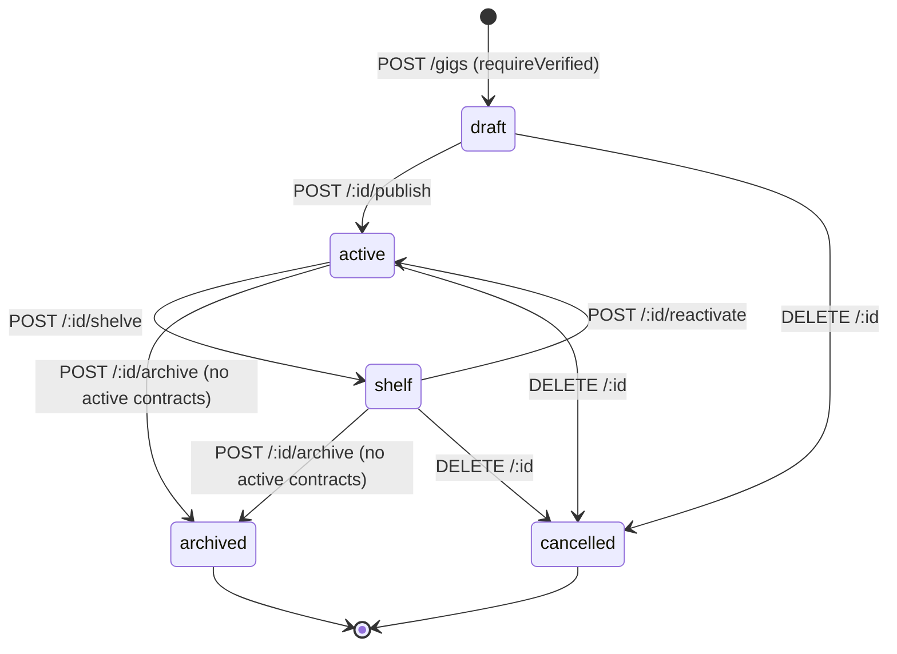

# Guide: Gig Lifecycle API

A gig is the central object in gigs.ge — it represents a job a poster wants done. Understanding how gigs move through their lifecycle is key to understanding the whole platform.

## Why a Visibility Model?

Gigs aren't just "on" or "off". A poster needs to be able to:

- **Draft** a gig privately before it goes live (useful for review, image upload)
- **Shelf** an active gig temporarily (e.g., they're on holiday, no longer accepting applications)
- **Archive** a completed or unwanted gig cleanly
- **Cancel** a gig immediately without needing to archive it first

Each state controls what actions are possible and who can see the gig.

## Gig Status State Machine

Key constraint: **archiving is blocked if any contract on the gig is in an active status** (i.e., `in_progress`, `pending_completion`, `disputed`, or `arbitration`). This prevents data loss — you can't sweep a gig under the rug while a live dispute is still open.

Only `active` gigs appear in the public listing (`GET /gigs`). `draft`, `shelf`, `archived`, and `cancelled` gigs are hidden from search.

## Endpoints

### Public

| Method | Path | Auth | Purpose |
|--------|------|------|---------|
| GET | `/gigs` | — | List active gigs (paginated, filterable by region/city) |
| GET | `/gigs/:id` | — | Get a single gig with its images |

### Poster Actions (requires `requireVerified`)

| Method | Path | Purpose |
|--------|------|---------|
| POST | `/gigs` | Create a draft gig |
| PATCH | `/gigs/:id` | Edit a draft gig |
| POST | `/gigs/:id/publish` | Transition draft → active |
| POST | `/gigs/:id/shelve` | Pause an active gig |
| POST | `/gigs/:id/reactivate` | Unpause a shelved gig |
| POST | `/gigs/:id/archive` | Permanently archive (no active contracts) |
| DELETE | `/gigs/:id` | Cancel the gig |

### Images (max 8 per gig)

| Method | Path | Purpose |
|--------|------|---------|
| POST | `/gigs/:id/images` | Add an image URL |
| DELETE | `/gigs/:id/images/:imgId` | Remove an image |

Images are uploaded to Cloudflare R2 separately (see [Storage Upload](../architecture/visibility-model.md)). This endpoint just registers the already-uploaded URL with the gig record.

### Community Features

| Method | Path | Purpose |
|--------|------|---------|
| POST | `/gigs/:id/flags` | Report a gig (one flag per user per gig) |
| POST | `/gigs/:id/info-requests` | Ask the poster for a specific field |
| GET | `/gigs/:id/info-requests` | Poster views all info requests on their gig |
| PATCH | `/gigs/:id/info-requests/:reqId` | Poster resolves an info request |

**Why info requests?** The Georgian gig market often involves informal negotiations. Rather than forcing all communication into a free-text message, info requests let applicants ask structured questions (e.g., "What's the exact location?"), and posters can answer them on the record.

## Gig Expiry

New gigs are given an `expiresAt` of **90 days** from creation (`MAX_GIG_EXPIRY_DAYS`). A background job (not yet implemented in v1) will auto-archive expired gigs. This keeps the listings fresh and prevents zombie gigs from accumulating.

## Editing Rules

Editing (`PATCH /:id`) is only allowed while the gig is in `draft` status. Once published, the gig's core terms are locked to preserve the integrity of applications and contracts that reference it. To change terms after publishing, a poster must cancel and recreate the gig.

---

**Related:** [API Applications](./api-applications.md) · [API Contracts](./api-contracts.md) · [Architecture: Visibility Model](../architecture/visibility-model.md)
